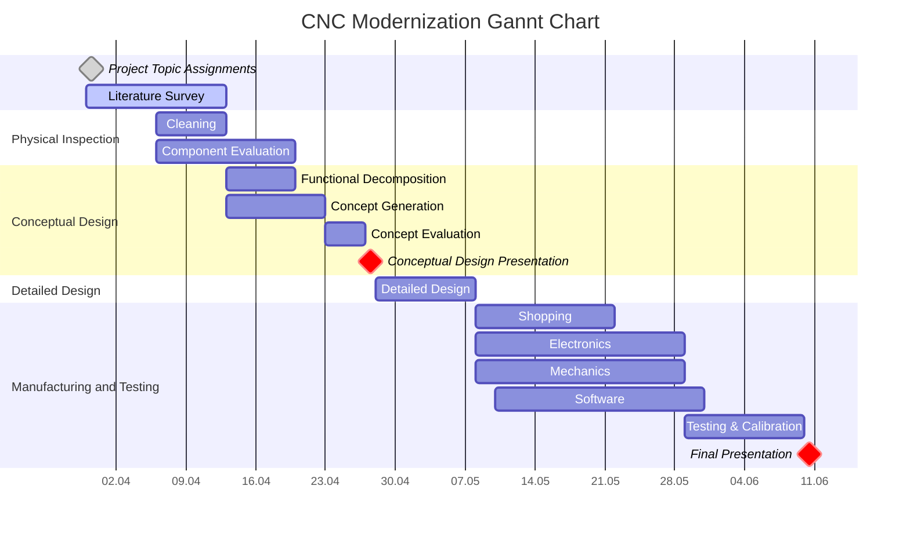

```mermaid
gantt
    dateFormat  DD.MM.YY
    axisFormat  %d.%m
    title       CNC Modernization Gannt Chart
    todayMarker on

    Project Topic Assignments :    done,milestone,f1,30.03.23,1d

    Literature Survey         : active,lit_sur, 30.03.23, 2w

    section Physical Inspection
    Cleaning                  : ins1,06.04.23,1w
    Component Evaluation      : ins2,06.04.23,2w


    section Conceptual Design
    Functional Decomposition  : cd1,13.04.23, 1w
    Concept Generation        : cd2,13.04.23, 10d
    Concept Evaluation        : cd3,after cd2,4d
    Conceptual Design Presentation: crit,milestone, cd3, 27.04.23,1d

    section Detailed Design
    Detailed Design           : dd2, after cd3, 10d

    section Manufacturing and Testing
    Shopping: shop, after dd2,2w
    Electronics: elec, after dd2,3w
    Mechanics: mech, after dd2,3w
    Software: soft,10.05.23,3w
    Testing & Calibration: test, after mech,10.06.23
    Final Presentation:    crit,milestone,final,10.06.23,1d
```

