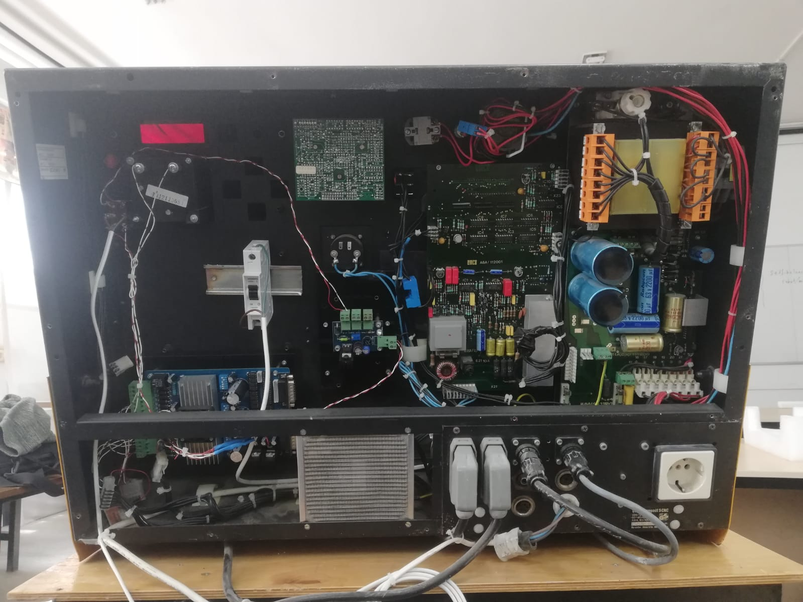
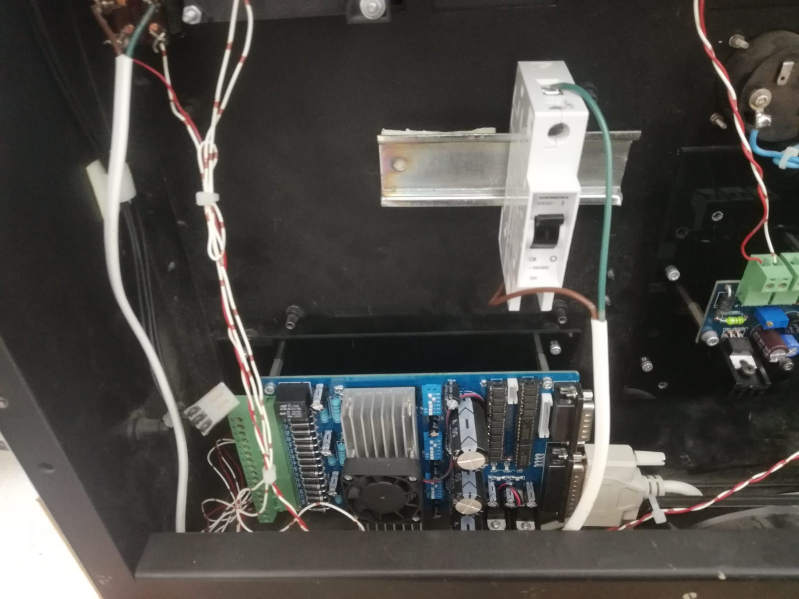
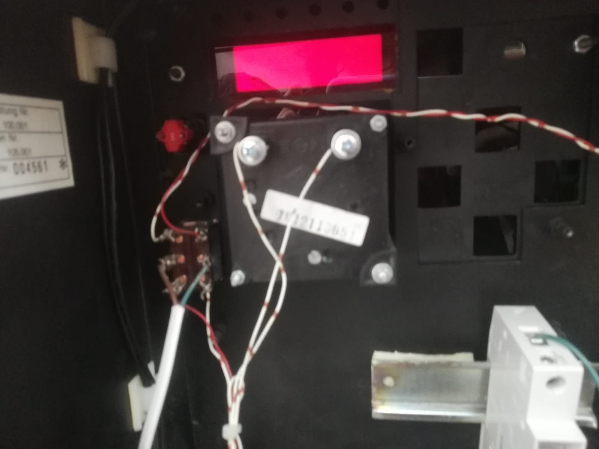
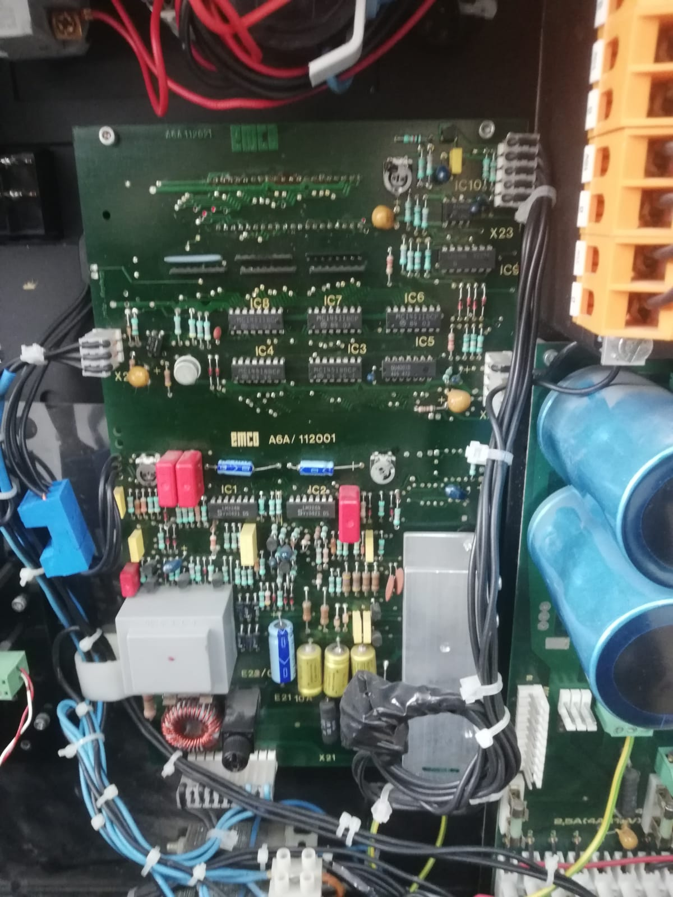
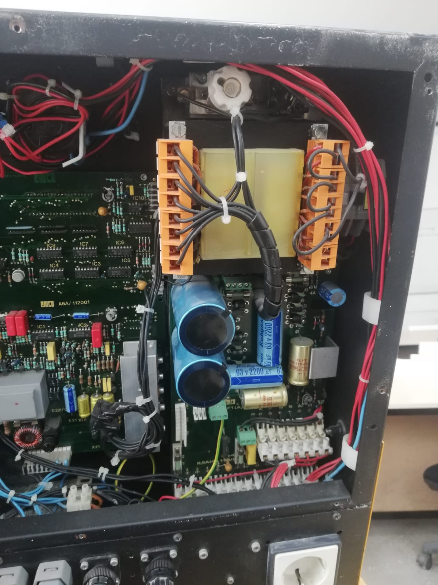

# Meeting 3

**Date**: 13.04.23

**Place:** Mechatronics Laboratory

**Start:** 12.00

**Finish:** 13.20

## Meeting Notes

* EMCO Compact CNC Torna arka paneli söküldü.
  
  

* Bazı parçaların yenilenmiş olduğu fark edildi. 
  
  * Step motor sürücüsü değiştirilmiş.
    
    
  
  * Ön panelde sonradan eklenen bölümler mevcut
    
    
  
  * Spindle kontrolcüsü ve Güç kartı orijinal
    
    
- 
